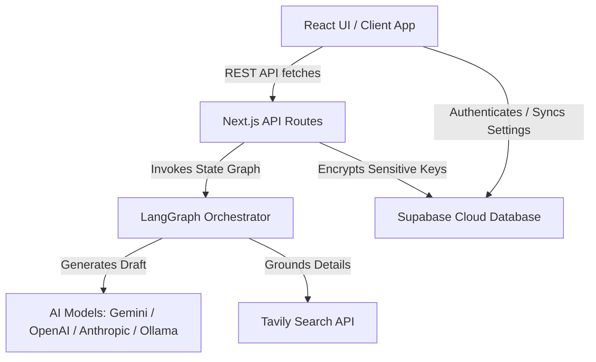

# LinkedIn Daily Posting Agent

An intelligent, stateful AI agent and dashboard designed to automate, search, draft, validate, and publish technical LinkedIn posts on-demand. The application runs as a web dashboard, desktop app (via Tauri), or mobile container (via Capacitor), using a unified TypeScript codebase.

---

## 🚀 Architecture & "Why We Use What"

Our architecture is designed to support both localized desktop/mobile executions and secure cloud-synchronized profiles.



### 1. Unified React & Next.js Framework
* **Why**: Next.js provides standard React frontend capabilities combined with high-performance edge/serverless API routes. This allows us to run our UI, authentication redirects, and backend orchestration logic in a single unified codebase.
* **Role**: The frontend compiles to a pure client-side SPA (`out/`) to fit into Tauri/Capacitor native containers, while the backend API routes run on a server to manage database communication and protect third-party keys.

### 2. LangGraph Stateful Orchestration
* **Why**: LangGraph enables us to model the drafting, grounding, validation, and human-in-the-loop approval as a stateful graph (a state machine). It allows breakpoints where execution pauses for human approval before committing the post to LinkedIn.
* **Role**: Manages transitions between nodes: `generatePost` (AI draft generation) ➔ `validatePost` ➔ `publishPost` (LinkedIn API).

### 3. Native App Containers: Tauri & Capacitor
* **Why**: 
  * **Tauri (Desktop)**: Uses Rust to compile a native webview container. Tauri apps are lightweight (~5MB) and fast compared to standard Electron wrappers (~100MB+).
  * **Capacitor (Mobile)**: Embeds the static exported files into iOS/Android native projects with full platform capabilities, eliminating the need to write separate native code.

### 4. Supabase & Crypto Sync
* **Why**: To enable a multi-user environment, we use **Supabase** for user authentication and user settings synchronization.
* **Role**: Sensitive API keys (Google, OpenAI, Anthropic, Tavily, and LinkedIn OAuth tokens) are encrypted locally using an AES encryption key before being synced to Supabase, guaranteeing user data privacy.

---

## 📂 Project Directory Structure

```
├── .planning/            # GSD planning, roadmap, and task logs
├── public/               # Static assets & favicon vector images
├── scripts/              # Static build helper scripts
├── src/
│   ├── app/              # Next.js pages (App Router) & backend API endpoints
│   ├── components/       # Reusable React components (Control Panel, Editor, etc.)
│   ├── core/             # Core state schemas and AI prompt templates
│   ├── graph/            # LangGraph state nodes, builders, and execution routes
│   ├── hooks/            # Client state hooks (useAgent)
│   ├── lib/              # Database clients, API helpers, and shared utilities
│   ├── services/         # Integrations (LinkedIn REST, LLM instantiations, Supabase)
│   └── tests/            # Automated Mocha/Node unit tests
├── src-tauri/            # Rust/Tauri workspace configs & native desktop build config
└── capacitor.config.ts   # Capacitor mobile wrapper configuration
```

---

## ⚙️ Configuration (.env)

Duplicate `.env.example` to `.env` and configure:

| Key | Description |
| :--- | :--- |
| `GOOGLE_API_KEY` | Gemini API key for default AI models. |
| `TAVILY_API_KEY` | Optional. Used by the agent to search the web for grounding. |
| `SUPABASE_URL` | Supabase project URL for cloud synchronization. |
| `SUPABASE_SERVICE_ROLE_KEY` | Database service role key for decryption. |
| `ENCRYPTION_KEY` | 32-byte hex key for encrypting user credentials before cloud sync. |
| `LINKEDIN_CLIENT_ID` | OAuth Client ID from LinkedIn Developer Portal. |
| `LINKEDIN_CLIENT_SECRET` | OAuth Client Secret from LinkedIn Developer Portal. |
| `LINKEDIN_REDIRECT_URI` | Redirection callback (e.g. `http://localhost:3000/api/auth/linkedin/callback`). |
| `NEXT_PUBLIC_API_URL` | Public backend URL (used by static client containers). |

---

## 🛠️ Development Workflow

### Running Locally
1. Install dependencies:
   ```bash
   npm install
   ```
2. Start the dev server:
   ```bash
   npm run dev
   ```
3. Open `http://localhost:3000` to view the web portal.

### Testing & Linting
* Run ESLint checks:
  ```bash
  npm run lint
  ```
* Run all unit tests:
  ```bash
  npm run test
  ```

---

## 📦 Packaging & Building Native Apps

Native app containers run purely as client-side static assets, fetching from your hosted production Next.js backend server.

### 1. Build Static Frontend
Compile the frontend to the static `out/` directory:
```bash
npm run build:static
```

### 2. Desktop Installer (Tauri)
* **Start Dev Mode**:
  ```bash
  npx tauri dev
  ```
* **Build Native Installers**:
  ```bash
  npx tauri build
  ```
  Installers will compile into `src-tauri/target/release/bundle/`.

### 3. Mobile Bundles (Capacitor)
1. Add target platforms:
   ```bash
   npx cap add android
   npx cap add ios
   ```
2. Sync the compiled `out/` assets to the native containers:
   ```bash
   npm run build:static
   npx cap sync
   ```
3. Open in native editors to compile:
   ```bash
   npx cap open android   # Opens Android Studio
   npx cap open ios       # Opens Xcode
   ```

---

## 📝 Troubleshooting & FAQ

#### 1. Why does my Tauri release app open up to a "404 Not Found" page?
* **Reason**: Tauri's webview loads `/index.html` on startup. Next.js App Router reads this pathname and fails to match it.
* **Solution**: Ensure your [layout.tsx](src/app/layout.tsx) includes the head routing script to rewrite `/index.html` to `/` on client initialization:
  ```javascript
  if (window.location.pathname.endsWith('/index.html')) {
    const safePath = window.location.pathname.replace(/\/index\.html$/, '') || '/';
    window.history.replaceState(null, '', safePath + window.location.search);
  }
  ```

#### 2. EPERM: operation not permitted rename during `build:static`
* **Reason**: Windows locks the `src/app/api` directory because a dev server (like `npx tauri dev` or Next.js dev server) is watching it.
* **Solution**: Close all active dev servers (`Ctrl+C`) and run the build command again.
