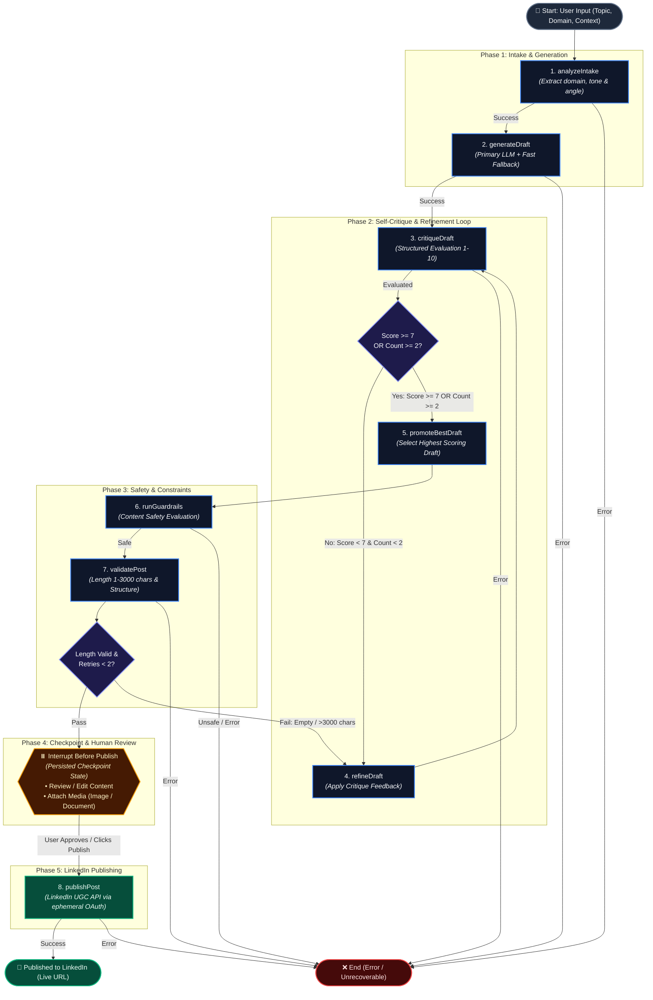

# Praxis — Autonomous LinkedIn AI Agent & Studio

> A domain-driven, stateful AI agent platform built with **Next.js 16**, **LangGraph**, and **Supabase** that drafts, self-critiques, refines, and publishes high-impact technical posts to LinkedIn with multi-image/PDF carousel support.

---

## ✨ Key Features

- **Autonomous Multi-Step LangGraph Agent**:
  - **Authentic Practitioner Persona**: Banned AI slop and sterile textbook monologues; writes with senior practitioner credibility ("Last month we migrated...", "Here is what broke...").
  - **5 Post Archetypes**: Incident Teardown, Contrarian Take, Playbook / Framework, Gotcha / Deep Dive, and Decision Matrix.
  - **Tone & Voice Tuning**: Conversational, Authoritative, Provocative, and Reflective controls.
  - **Feed Truncation Hook Engineering**: Optimizes opening lines for the 2-3 line (140-210 char) preview boundary before "...see more".
  - **Hook Lab (A/B Testing)**: Concurrently generates 3 contrasting hook angles (Metric, Contrarian, Incident) with a 1-click swapper above the fold.
  - **Conversational Draft Refinement**: Natural-language follow-ups in the composer ("make it punchier", "shorter", "focus on outcome") with scoped edits and hook preservation.
  - **Anti-Fabrication Guardrail**: Refuses ungrounded metric requests without real data, prompting conversationally instead of hallucinating benchmarks.
  - **Multi-Level Version History Stack**: 1-click Undo/Redo and version dropdown (`v1 · Initial Draft`, `v2...`) in the editor toolbar.
  - **Iterative Self-Critique & Refinement Loop**: Evaluates hooks, value clarity, and structure with automated scoring (threshold 7, capped at 2 refinement passes).
  - **Safety & Guardrails**: Enforces LinkedIn content safety and character limits before publication.
- **Multi-Provider LLM Engine**:
  - Native support for **Google Gemini** (Gemini 2.5 Flash / 3.7 Flash with reasoning budget controls), **OpenAI** (GPT-4o), **Anthropic** (Claude 3.5 / 3.7 Sonnet), and local **Ollama** models.
- **Real-Time Streaming Dashboard**:
  - Live Server-Sent Events (SSE) stream displaying token generation, chain-of-thought reasoning, and step progress.
  - Interactive LinkedIn post preview with responsive image mosaic (1–20 images/PDF carousels).
- **PostgreSQL State Persistence & Session Checkpoints**:
  - Custom `SupabaseCheckpointer` persisting LangGraph state checkpoints and thread history to Supabase PostgreSQL.
- **Secure Multi-User Credentials & OAuth**:
  - AES-256-GCM encryption at rest for user API keys and LinkedIn OAuth tokens.

---

## 🏗️ Architecture & Folder Structure

Praxis uses a clean, domain-driven modular architecture:

```
src/
├── app/               # Next.js App Router (UI dashboard & API route handlers)
│   ├── api/           # API endpoints (/draft, /publish, /health-check, /auth, /user, /media)
│   └── page.tsx       # Main dashboard application interface
├── components/        # Reusable UI & layout components (Header, ControlPanel, EditorPanel)
├── config/            # Environment parsing (env.ts) & database DDL (schema.sql)
├── hooks/             # Composed React hooks (useAgent, useAgentSettings, useAgentMedia, useAgentRuntime)
├── lib/               # Shared infrastructure (API client, Supabase client/server, logger, utils)
├── modules/           # Domain-driven feature modules
│   ├── agent/         # LangGraph graph, nodes, prompts, schemas, checkpointer, LLM factory & health check
│   ├── auth/          # Session auth, AES-256 crypto, LinkedIn OAuth callback
│   ├── linkedin/      # UGC API publisher, token manager, LinkedInFeed UI preview
│   ├── user/          # User settings persistence, post history, SettingsDialog UI dialog
│   └── media/         # Presigned storage uploads & file management
├── tests/             # Comprehensive Jest test suite (unit, integration, evals, logger, UI)
└── types/             # Consolidated global & database types (database.types, stream, keys, config, health)
```

---

## ⚙️ Environment Configuration

Create a `.env` file in the project root based on `.env.example`:

```env
# ── Core LLM API Keys ──────────────────────────────
GOOGLE_API_KEY="your-google-gemini-api-key"
# Optional secondary providers:
OPENAI_API_KEY=""
ANTHROPIC_API_KEY=""

# ── Supabase Configuration ──────────────────────────
SUPABASE_URL="https://your-project-ref.supabase.co"
SUPABASE_SERVICE_ROLE_KEY="your-supabase-service-role-key"
NEXT_PUBLIC_SUPABASE_URL="https://your-project-ref.supabase.co"
NEXT_PUBLIC_SUPABASE_ANON_KEY="your-supabase-anon-key"

# ── Encryption & Security (AES-256-GCM) ─────────────
# Generate via: node -e "console.log(require('crypto').randomBytes(32).toString('hex'))"
ENCRYPTION_KEY="your-32-byte-hex-encryption-key"

# ── LinkedIn OAuth App Credentials ──────────────────
LINKEDIN_CLIENT_ID="your-linkedin-client-id"
LINKEDIN_CLIENT_SECRET="your-linkedin-client-secret"
LINKEDIN_REDIRECT_URI="http://localhost:3000/api/auth/linkedin/callback"

# Optional fallback credentials (for single-user / direct posting mode)
LINKEDIN_ACCESS_TOKEN=""
LINKEDIN_PERSON_URN=""

# ── Observability & Tracing (LangSmith) ─────────────
LANGSMITH_TRACING=true
LANGSMITH_ENDPOINT="https://eu.api.smith.langchain.com"
LANGSMITH_API_KEY="your-langsmith-api-key"
LANGSMITH_PROJECT="Praxis"
```

---

## 🗄️ Database Setup

1. Open your **Supabase Dashboard** SQL Editor.
2. Run the DDL script found in [`src/config/schema.sql`](file:///d:/Work/linkedin-agent/src/config/schema.sql) to initialize:
   - `public.user_settings` (encrypted credentials and model preferences)
   - `public.user_post_history` (published post tracking & hook deduplication)
   - `public.agent_checkpoints` & `public.agent_checkpoint_writes` (LangGraph thread checkpoints)
   - `temp-uploads` storage bucket with public read access.

---

## 🚀 Quick Start

### 1. Install Dependencies

```bash
npm install
```

### 2. Run the Development Server

```bash
npm run dev
```

Open [http://localhost:3000](http://localhost:3000) in your browser.

### 3. Build for Production

```bash
npm run build
npm start
```

---

## 🧪 Testing & Code Quality

```bash
# 1. TypeScript compilation check (0 errors)
npx tsc --noEmit

# 2. Run ESLint validation (0 errors, 0 warnings)
npm run lint

# 3. Run all unit & UI test suites (17 suites, 158 tests)
npx jest --testPathIgnorePatterns="integration"

# 4. Run integration tests (requires Supabase / live service configuration)
npx jest src/tests/integration.test.ts

# 5. Run full test suite with coverage
npm test -- --coverage

# 6. Verify production build
npm run build
```

---

## 🔁 LangGraph Agent Workflow


```mermaid
graph TD
    %% Styling & Theme
    classDef startEnd fill:#1e293b,stroke:#64748b,stroke-width:2px,color:#f8fafc;
    classDef processNode fill:#0f172a,stroke:#3b82f6,stroke-width:2px,color:#f8fafc;
    classDef decisionNode fill:#1e1b4b,stroke:#818cf8,stroke-width:2px,color:#f8fafc;
    classDef interruptNode fill:#451a03,stroke:#f59e0b,stroke-width:2px,color:#fef3c7;
    classDef publishNode fill:#064e3b,stroke:#10b981,stroke-width:2px,color:#ecfdf5;
    classDef errorNode fill:#450a0a,stroke:#ef4444,stroke-width:2px,color:#fee2e2;

    Start(["🚀 Start: User Input (Topic, Domain, Context)"]):::startEnd
    ErrExit(["❌ End (Error / Unrecoverable)"]):::errorNode
    Done(["🎉 Published to LinkedIn (Live URL)"]):::publishNode

    subgraph Intake & Generation ["Phase 1: Intake & Generation"]
        Analyze["1. analyzeIntake<br/><i>(Extract domain, tone & angle)</i>"]:::processNode
        Generate["2. generateDraft<br/><i>(Primary LLM + Fast Fallback)</i>"]:::processNode
    end

    subgraph Reflection Loop ["Phase 2: Self-Critique & Refinement Loop"]
        Critique["3. critiqueDraft<br/><i>(Structured Evaluation 1-10)</i>"]:::processNode
        ScoreCheck{"Score >= 7<br/>OR Count >= 2?"}:::decisionNode
        Refine["4. refineDraft<br/><i>(Apply Critique Feedback)</i>"]:::processNode
        Promote["5. promoteBestDraft<br/><i>(Select Highest Scoring Draft)</i>"]:::processNode
    end

    subgraph Safety & Validation ["Phase 3: Safety & Constraints"]
        Guardrails["6. runGuardrails<br/><i>(Content Safety Evaluation)</i>"]:::processNode
        Validate["7. validatePost<br/><i>(Length 1-3000 chars & Structure)</i>"]:::processNode
        ValidCheck{"Length Valid &<br/>Retries < 2?"}:::decisionNode
    end

    subgraph Human in the Loop ["Phase 4: Checkpoint & Human Review"]
        Interrupt{{"⏸️ Interrupt Before Publish<br/><i>(Persisted Checkpoint State)</i><br/>• Review / Edit Content<br/>• Attach Media (Image / Document)"}}:::interruptNode
    end

    subgraph Publication ["Phase 5: LinkedIn Publishing"]
        Publish["8. publishPost<br/><i>(LinkedIn UGC API via ephemeral OAuth)</i>"]:::publishNode
    end

    %% Flow connections
    Start --> Analyze
    Analyze -->|Success| Generate
    Analyze -->|Error| ErrExit

    Generate -->|Success| Critique
    Generate -->|Error| ErrExit

    Critique -->|Evaluated| ScoreCheck
    Critique -->|Error| ErrExit

    ScoreCheck -->|No: Score < 7 & Count < 2| Refine
    ScoreCheck -->|Yes: Score >= 7 OR Count >= 2| Promote
    Refine --> Critique

    Promote --> Guardrails
    Guardrails -->|Safe| Validate
    Guardrails -->|Unsafe / Error| ErrExit

    Validate --> ValidCheck
    Validate -->|Error| ErrExit
    ValidCheck -->|Pass| Interrupt
    ValidCheck -->|Fail: Empty / >3000 chars| Refine

    Interrupt -->|User Approves / Clicks Publish| Publish
    Publish -->|Success| Done
    Publish -->|Error| ErrExit
```

---
 
## 📚 Documentation
 
Detailed technical and operational documentation is available in the [`docs/`](docs/) directory:
 
- [System Architecture](docs/ARCHITECTURE.md) — Comprehensive multi-agent architecture, LangGraph nodes, state design, and data flows.
- [Getting Started](docs/GETTING-STARTED.md) — Prerequisites, environment provisioning, database migration, and local verification.
- [Development Guide](docs/DEVELOPMENT.md) — Project structure, engineering workflows, scripts, code style, and branch conventions.
- [Testing & Quality Assurance](docs/TESTING.md) — Jest test suites, unit/UI testing, mocking patterns, and coverage analysis.
- [Configuration Reference](docs/CONFIGURATION.md) — Environment variables, secrets encryption, LLM models, and runtime options.
- [API Reference](docs/API.md) — Endpoints overview, request/response formats, SSE streaming, authentication, and error codes.
- [Deployment Guide](docs/DEPLOYMENT.md) — Production build, Vercel deployment, Supabase setup, and monitoring.
 
---
 
## 📜 License
 
MIT License. Designed and engineered for high-impact social publishing.
