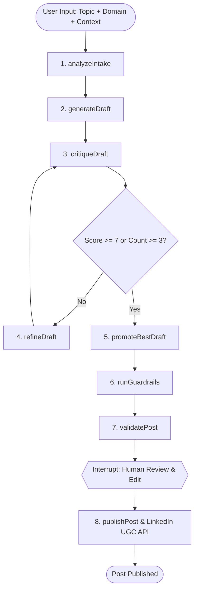

# Praxis — Autonomous LinkedIn AI Agent & Studio

> A domain-driven, stateful AI agent platform built with **Next.js 15**, **LangGraph**, and **Supabase** that drafts, self-critiques, refines, and publishes high-impact technical posts to LinkedIn with multi-image/PDF carousel support.

---

## ✨ Key Features

- **Autonomous Multi-Step LangGraph Agent**:
  - **Intake Analysis & Tone Tuning**: Inferred or user-specified domain targeting (Engineering, HR, Marketing, Sales, General).
  - **Iterative Self-Critique & Refinement Loop**: Evaluates hooks, value clarity, and structure with automated scoring (up to 3 refinement passes).
  - **Safety & Guardrails**: Enforces LinkedIn content safety and character limits before publication.
  - **Human-in-the-Loop Interruption**: Pauses execution at draft completion for user review, custom edits, and image attachments.
- **Multi-Provider LLM Engine**:
  - Native support for **Google Gemini** (Gemini 2.5 Flash / 3.7 Flash with reasoning budget controls), **OpenAI** (GPT-4o), **Anthropic** (Claude 3.5 / 3.7 Sonnet), and local **Ollama** models.
- **Real-Time Streaming Dashboard**:
  - Live Server-Sent Events (SSE) stream displaying token generation, chain-of-thought reasoning, and step progress.
  - Interactive LinkedIn post preview with responsive image mosaic (1–20 images/PDF carousels).
- **PostgreSQL State Persistence & Session Checkpoints**:
  - Custom `SupabaseCheckpointer` persisting LangGraph state checkpoints and thread history to Supabase PostgreSQL.
- **Secure Multi-User Credentials & OAuth**:
  - AES-256-GCM encryption at rest for user API keys and LinkedIn OAuth tokens.
- **Native Desktop & Web**:
  - Runs in any modern web browser or as a native desktop application via **Tauri v2**.

---

## 🏗️ Architecture & Folder Structure

Praxis uses a clean, domain-driven modular architecture:

```
src/
├── app/               # Next.js App Router (UI dashboard & API route handlers)
│   ├── api/           # API endpoints (/draft, /publish, /health-check, /auth, /user, /media)
│   └── page.tsx       # Main dashboard application interface
├── components/        # Reusable UI & layout components (Header, ControlPanel, EditorPanel)
├── config/            # Environment parsing (env.ts) & database DDL (schema.sql)
├── hooks/             # Composed React hooks (useAgent, useAgentSettings, useAgentMedia, useAgentRuntime)
├── lib/               # Shared infrastructure (API client, Supabase client/server, logger, utils)
├── modules/           # Domain-driven feature modules
│   ├── agent/         # LangGraph graph, nodes, prompts, schemas, checkpointer, LLM factory & health check
│   ├── auth/          # Session auth, AES-256 crypto, LinkedIn OAuth callback
│   ├── linkedin/      # UGC API publisher, token manager, LinkedInFeed UI preview
│   ├── user/          # User settings persistence, post history, SettingsDialog UI dialog
│   └── media/         # Presigned storage uploads & file management
├── tests/             # Comprehensive Jest test suite (unit, integration, evals, logger, UI)
└── types/             # Consolidated global & database types (database.types, stream, keys, config, health)
```

---

## ⚙️ Environment Configuration

Create a `.env` file in the project root based on `.env.example`:

```env
# ── Core LLM API Keys ──────────────────────────────
GOOGLE_API_KEY="your-google-gemini-api-key"
# Optional secondary providers:
OPENAI_API_KEY=""
ANTHROPIC_API_KEY=""

# ── Supabase Configuration ──────────────────────────
SUPABASE_URL="https://your-project-ref.supabase.co"
SUPABASE_SERVICE_ROLE_KEY="your-supabase-service-role-key"
NEXT_PUBLIC_SUPABASE_URL="https://your-project-ref.supabase.co"
NEXT_PUBLIC_SUPABASE_ANON_KEY="your-supabase-anon-key"

# ── Encryption & Security (AES-256-GCM) ─────────────
# Generate via: node -e "console.log(require('crypto').randomBytes(32).toString('hex'))"
ENCRYPTION_KEY="your-32-byte-hex-encryption-key"

# ── LinkedIn OAuth App Credentials ──────────────────
LINKEDIN_CLIENT_ID="your-linkedin-client-id"
LINKEDIN_CLIENT_SECRET="your-linkedin-client-secret"
LINKEDIN_REDIRECT_URI="http://localhost:3000/api/auth/linkedin/callback"

# Optional fallback credentials (for single-user / direct posting mode)
LINKEDIN_ACCESS_TOKEN=""
LINKEDIN_PERSON_URN=""

# ── Observability & Tracing (LangSmith) ─────────────
LANGSMITH_TRACING=true
LANGSMITH_ENDPOINT="https://eu.api.smith.langchain.com"
LANGSMITH_API_KEY="your-langsmith-api-key"
LANGSMITH_PROJECT="Praxis"
```

---

## 🗄️ Database Setup

1. Open your **Supabase Dashboard** SQL Editor.
2. Run the DDL script found in [`src/config/schema.sql`](file:///d:/Work/linkedin-agent/src/config/schema.sql) to initialize:
   - `public.user_settings` (encrypted credentials and model preferences)
   - `public.user_post_history` (published post tracking & hook deduplication)
   - `public.agent_checkpoints` & `public.agent_checkpoint_writes` (LangGraph thread checkpoints)
   - `temp-uploads` storage bucket with public read access.

---

## 🚀 Quick Start

### 1. Install Dependencies

```bash
npm install
```

### 2. Run the Development Server

```bash
npm run dev
```

Open [http://localhost:3000](http://localhost:3000) in your browser.

### 3. Run Native Desktop App (Optional)

```bash
npm run tauri:dev
```

### 4. Build for Production

```bash
npm run build
npm start
```

---

## 🧪 Testing & Code Quality

```bash
# Run ESLint validation
npm run lint

# Run all test suites (Unit, Integration, Evals, API, and UI)
npm run tests
```

---

## 🔁 LangGraph Agent Workflow


```mermaid
graph TD
    Start([User Input: Topic + Domain + Context]) --> Analyze[1. analyzeIntake]
    Analyze --> Generate[2. generateDraft]
    Generate --> Critique[3. critiqueDraft]
    Critique --> Decision{Score >= 7 or Count >= 3?}
    Decision -- No --> Refine[4. refineDraft]
    Refine --> Critique
    Decision -- Yes --> Promote[5. promoteBestDraft]
    Promote --> Guardrail[6. runGuardrails]
    Guardrail --> Validate[7. validatePost]
    Validate --> Pause{{Interrupt: Human Review & Edit}}
    Pause --> Publish[8. publishPost & LinkedIn UGC API]
    Publish --> Done([Post Published])
```

---

## 📜 License

MIT License. Designed and engineered for high-impact social publishing.
