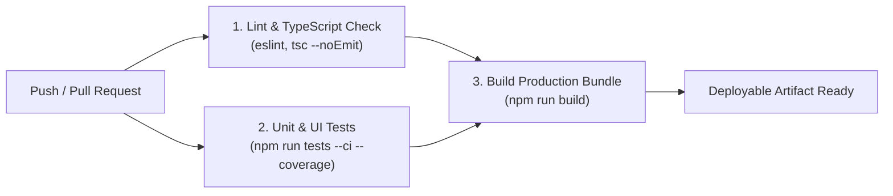

<!-- generated-by: gsd-doc-writer -->
# Deployment Guide

This guide covers production deployment targets, automated CI/CD pipelines, environment variable setup, rollback procedures, and observability monitoring for Praxis.

---

## Deployment Targets

### 1. Vercel (Recommended Primary Target)
Praxis is architected as a Next.js 16 App Router application optimized for deployment on the Vercel Serverless platform.
- **Serverless API Routes**: API endpoints (`/api/draft`, `/api/publish`) run as Vercel Serverless Functions with `maxDuration = 60` seconds configured for streaming generation.
- **Frontend Assets**: Static pages and React 19 UI components are built and served via the Vercel Edge Network CDN.
- **Analytics**: Built-in integration with `@vercel/analytics`.

### 2. Node.js Standalone / Docker
Praxis can also run as a persistent Node.js server:
```bash
npm run build
npm start
```
Runs on port 3000 by default (override with `PORT=8080`).

### 3. Supabase Cloud (Managed Infrastructure)
Praxis relies on Supabase for:
- PostgreSQL database hosting (state checkpoints, user credentials, post history).
- Ephemeral media storage bucket (`temp-uploads`).
- User authentication and JWT verification.

<!-- VERIFY: Live production deployment URLs and custom domain DNS records must be configured in your Vercel Project Dashboard. -->

---

## Build Pipeline (CI/CD)

Continuous integration and automated build verification are defined in [`.github/workflows/ci.yml`](file:///d:/Work/linkedin-agent/.github/workflows/ci.yml).

The pipeline executes on every push to `main`, `dev`, or `feature/**` branches, and on all pull requests:



### CI Pipeline Steps
1. **Lint & Type Check**:
   - Runs on `ubuntu-latest` with Node.js 22.
   - Executes `npm run lint` and `npx tsc --noEmit`.
2. **Automated Unit & UI Testing**:
   - Executes `npm run tests -- --ci --coverage` across all 17 test suites (158 tests).
3. **Production Compilation**:
   - Compiles Next.js bundle via `npm run build`.

---

## Environment Setup

When deploying to production (e.g. Vercel Project Settings > Environment Variables), ensure all required variables from [docs/CONFIGURATION.md](CONFIGURATION.md) are configured:

### 1. Security & Encryption
```env
# 32-byte hexadecimal encryption key (REQUIRED in production)
ENCRYPTION_KEY="0123456789abcdef0123456789abcdef0123456789abcdef0123456789abcdef"
```

### 2. Supabase Cloud Credentials
```env
SUPABASE_URL="https://<your-project-id>.supabase.co"
SUPABASE_SERVICE_ROLE_KEY="eyJhbGciOi..."
NEXT_PUBLIC_SUPABASE_URL="https://<your-project-id>.supabase.co"
NEXT_PUBLIC_SUPABASE_ANON_KEY="eyJhbGciOi..."
```

### 3. Primary LLM Provider
```env
GOOGLE_API_KEY="AIzaSy..."
# Optional secondary providers:
OPENAI_API_KEY="sk-proj-..."
ANTHROPIC_API_KEY="sk-ant-..."
```

### 4. LinkedIn Production OAuth
```env
LINKEDIN_CLIENT_ID="<your-linkedin-client-id>"
LINKEDIN_CLIENT_SECRET="<your-linkedin-client-secret>"
LINKEDIN_REDIRECT_URI="https://<your-production-domain>/api/auth/linkedin/callback"
```

### 5. Observability (LangSmith & Logging)
```env
LANGSMITH_TRACING=true
LANGSMITH_ENDPOINT="https://api.smith.langchain.com"
LANGSMITH_API_KEY="lsv2_pt_..."
LANGSMITH_PROJECT="Praxis-Production"
LOG_LEVEL="info"
LOG_FORMAT="json"
```

---

## Rollback Procedure

If a deployed version experiences issues or unexpected regressions in production:

### 1. Instant Vercel Rollback
1. Open your project in the [Vercel Dashboard](https://vercel.com).
2. Navigate to the **Deployments** tab.
3. Locate the previous stable deployment.
4. Click the three dots (`...`) and select **Instant Rollback**.
5. Traffic will immediately route to the previous stable build artifact without rebuilding.

### 2. Git-Level Rollback
To revert a faulty commit via Git:
```bash
git checkout main
git revert HEAD --no-edit
git push origin main
```
This triggers the CI pipeline to compile and deploy the reverted commit automatically.

---

## Monitoring & Observability

### 1. Distributed Tracing with LangSmith
Every LangGraph agent node execution, LLM call, token usage metric, and latency checkpoint is automatically traced to LangSmith when `LANGSMITH_TRACING=true`.
<!-- VERIFY: LangSmith project dashboards are accessible at https://smith.langchain.com -->

### 2. Structured JSON Logging
In production (`NODE_ENV=production`), `src/lib/logger.ts` outputs JSON log events with timestamp, severity, module name, and execution duration:
```json
{
  "timestamp": "2026-09-22T22:30:00.000Z",
  "level": "info",
  "module": "Graph:generateDraft",
  "message": "Draft generation completed",
  "durationMs": 1420
}
```
All API keys, tokens, and authorization headers are automatically redacted by `redactSecrets`.

### 3. Vercel Web Analytics
Tracks Core Web Vitals, page view latency, and client performance metrics through `@vercel/analytics`.
